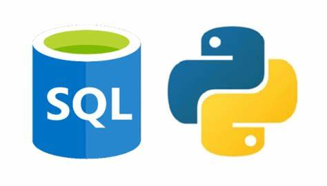

# Using SQL in Python using sqlite3

## Introduction
SQL and Python are two of the most popular programing languages and can be used effectively together.

Many businesses store their data in relational databases and SQL is a great tool to access and communicate with those data.

Python in the other hand is a powerful language which can be used in many processes of data science including Data Analysis, Data Visualizastion, Machine Learning, etc.

There are many way to intergrate SQL and Python. For example using pandas and one of the libraries like sqlite3, pyodbc, pymssql, etc.

In this project, I will desmontrate how to use sqlite3 in Python to access relational database and query data from the same notebook.

## Data
[Mental Health Dataset](https://www.kaggle.com/datasets/anth7310/mental-health-in-the-tech-industry)
is a small database with 3 tables about mental health in technology industry. The data were collected through the surveys from 2014 to 2019.

## Libraries to use
1. [Pandas](https://pandas.pydata.org/)
2. [Sqlite3](https://docs.python.org/3/library/sqlite3.html)

## Notebook
{MentalHealth_sqlite3](https://github.com/halethithu/Use_SQL_in_Python_with_sqlite3/blob/main/Sql_Mental_Health.ipynb)

## Walk through video

[Running SQL in Python using sqlite3 ](https://www.youtube.com/watch?v=Mrw9BopaTTE)

## Reference
[Open Sourcing Mental Illness - OSMI](https://osmihelp.org/research.html)

[SQL vs Python](https://www.datacamp.com/blog/sql-vs-python-which-to-learn)
